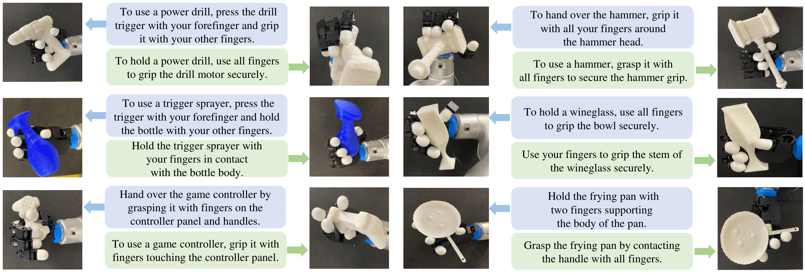

# <p align="center">Grasp as You Say: Language-guided Dexterous Grasp Generation</p>

### <p align="center">*Yi-Lin Wei, Jian-Jian Jiang, Chengyi Xing, Xiantuo Tan, Xiao-Ming Wu, Hao Li, <br> Mark Cutkosky, Wei-Shi Zheng*</p>

#### <p align="center">[[Paper]](https://arxiv.org/abs/2405.19291) &nbsp;&nbsp;&nbsp; [[Project]](https://isee-laboratory.github.io/DexGYS/) &nbsp;&nbsp;&nbsp; [[Dataset]](https://huggingface.co/datasets/wyl2077/DexGYS/tree/main) </p>


### (NeurIPS 2024) Official repository of paper "Grasp as You Say: Language-guided Dexterous Grasp Generation" 


## Install
- Create a new `conda` environemnt and activate it.
```
conda create -n dexgys python=3.8
conda activate dexgys
```
- Install the dependencies.
```
conda install -y pytorch==1.10.0 torchvision==0.11.0 cudatoolkit=11.3 -c pytorch -c conda-forge
pip install -r requirements.txt
```
- Build the pakage. 
> **Note**: The CUDA enviroment should be consistent in the phase of building and running (Recommendation: cuda11 or higher).
```
cd thirdparty/pytorch_kinematics
pip install -e .

cd ../pointnet2
python setup.py install 

cd ../
git clone https://github.com/wrc042/CSDF.git
cd CSDF
pip install -e .
cd ../../
```

## Data Preparation
1. Download dexterous grap label and language label of DexGYS from here[https://huggingface.co/datasets/wyl2077/DexGYS], and put in the "dexgys" in the path of "./data".

2. Download ShadowHand model mjcf from here[https://mirrors.pku.edu.cn/dl-release/UniDexGrasp_CVPR2023/], and put the "mjcf" in the path of "./data".

3. Download 3D mesh of object from here[https://oakink.net/], and put the "oakink" in the path of "./data".

4. Finally, the directory should as follow:
```
.data/
├── dexgys 
│ ├── train_with_guide_v2.1.json
│ ├── test_with_guide_v2.1.json
├── mjcf  
├── oakink 
│ ├── shape
```

## Usage
### Train 
1. Train Intention and Diversity Grasp Component (IDGC)
```
python train.py -t "./config/idgc.yaml"
```
2. Infer IDGC on train and test set to obatin training and testing pairs for QGC. 
```
python ./test.py \
--train_cfg ./config/idgc.yaml \
--test_cfg ./config/infer_idgc_train.yaml \
--override model.checkpoint_path \"<checkpoint-path>\"
```
```
python ./test.py \
--train_cfg ./config/idgc.yaml \
--test_cfg ./config/infer_idgc_test.yaml \
--override model.checkpoint_path \"<checkpoint-path>\"
```


3. Train Quality Grasp Component (QGC).

- Set the "data.train.pose_path" and "data.test.pose_path" of "./config/qgc.yaml" to the <matched_results.json> of the outcome of step2.
- For example: 
```
data:
  name: refinement
  train:
    data_root: &data_root "./data/oakink"
    pose_path: ./Experiments/idgc/test_results/epoch_<the epoch number>_train/matched_results.json
    ...
  val:
    data_root: *data_root
    pose_path: ./Experiments/idgc/test_results/epoch_<the epoch number>_test/matched_results.json
```
- Then run:
```
python train.py -t "./config/qgc.yaml"
```

### Test
- Infer QGC to refine the coarse outcome of IDGC. 
- Set "data.test.pose_path" of "./config/infer_qgc_test.yaml" to the <matched_results.json> of the outcome of LDGC.
```
data:
  name: refinement
  train:
    data_root: &data_root "./data/oakink"
    pose_path: ./Experiments/idgc/test_results/epoch_<the epoch number>_train/matched_results.json
    sample_in_pose: &sample_in_pose True
```
- Then run:
```
python ./test.py \
--train_cfg ./config/qgc.yaml \
--test_cfg ./config/infer_qgc_test.yaml \
--override model.checkpoint_path \"<checkpoint-path>\"
```

### Visualization
```
python scripts/vis/vis.py
```

### Evaluation
- Evaluation of FID:
```
python scripts/fid/test_fid.py -r \"<match_result-path>\"
```

- Evaluation of Q1:
```
"python scripts/q1/evaluate.py -r \"<raw_result-path>\" --gpus 0 1 2 3 4 5 6 7 
```

- Evaluation of Diversity:
```
python scripts/diversity/calc_diversity.py -r \"<raw_result-path>\"
```


## TODO
- [x] Release the datasets of GraspGYSNet
- [x] Release the visualization code of GraspGYS framework
- [x] Release the evaluation code of GraspGYS framework
- [x] Release the training code of GraspGYS framework
- [x] Release the inference code of GraspGYS framework

## Acknowledgements

The code of this repository is based on the following repositories. We would like to thank the authors for sharing their works.

- [UniDexGrasp](https://github.com/PKU-EPIC/UniDexGrasp)

- [Scene-Diffuser](https://github.com/scenediffuser/Scene-Diffuser)

## Contact
- Email: weiylin5@mail2.sysu.edu.cn

## Citation
Please cite it if you find this work useful.
```
@inproceedings{wei2024grasp,
  title = {Grasp as You Say: Language-guided Dexterous Grasp Generation},
  author = {Yi-Lin Wei and Jian-Jian Jiang and Chengyi Xing and Xian-Tuo Tan and Xiao-Ming Wu and Hao Li and Mark Cutkosky and Wei-Shi Zheng},
  booktitle = {Advances in Neural Information Processing Systems},
  year = {2024}
}
```
